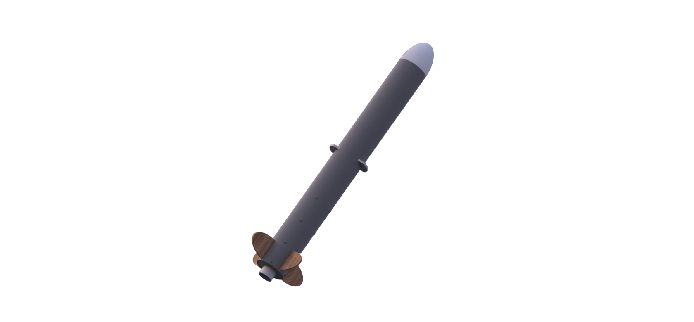

<!-- HEADER/NAV -->
<!-- HERO SECTION -->
  <section class="hero" id="home">
    

      

        ARC Mission 2026
      

      <h1>
        Active Airbrake <em>Altitude Control</em>
      </h1>
      

        A PID-controlled servo system that extends airbrakes in real time to hit a 750-foot apogee target, protect a raw egg payload, and demonstrate systems integration at scale.
      

      

        

          750 ft
          Target apogee
        

        

          36–39 s
          Flight window
        

        

          1 egg
          Payload
        

      

    

    

      
      
Full assembly render

    

  </section>

  <!-- MEDIA & TECHNICAL DETAILS SECTION -->
  <section class="section" id="media">
    

      
System overview

      <h2>PID control fundamentals</h2>
      

        Three corrective forces work together in our feedback loop: tracking error (P), accumulating drift (I), and smoothing oscillation (D).
      

    

    

      

        P
        
Proportional

        

          Directly corrects the error: the farther from target altitude, the more the servo extends the airbrakes.
          Fast but can overshoot.
        

      

      

        I
        
Integral

        

          Accumulates error over time to catch slow drift that P and D alone miss.
          Forces corrections when the rocket persistently over- or under-shoots.
        

      

      

        D
        
Derivative

        

          Tracks how fast error is changing to smooth servo movement, reduce
          wear, and eliminate oscillation around target.
        

      

    

    

      C++ controller
      Python SIL sim
      binary search tuning
      active airbrakes
      real-time avionics
    

    

      <h3>ARC 2026 media carousel</h3>
      
Airbrake control test footage plus current rocket build and avionics assembly snapshots.

      

        <button class="carousel-btn" id="arc26-prev" aria-label="Previous media">&#10094;</button>
        

          <video controls preload="metadata">
            <source src="arc26-media/Airbrake Control Test (Numerical Input) - Trim.mp4" type="video/mp4" />
            Your browser does not support the video tag.
          </video>
        

        

          
        

        

          
        

        

          
        

        <button class="carousel-btn" id="arc26-next" aria-label="Next media">&#10095;</button>
      

      

    

  </section>

  <!-- SPECS SECTION -->
  <section class="section" id="specs">
    

      
Mission requirements

      <h2>Flight envelope</h2>
      

        ARC defines a tight success window. Our avionics are designed to hit all three.
      

    

    

      

        

          <svg viewBox="0 0 20 20" fill="none">
            <path d="M10 2L10 15M10 2L7 7M10 2L13 7" stroke="#4f9cf9" stroke-width="1.6" stroke-linecap="round" stroke-linejoin="round"/>
            <path d="M4 17H16" stroke="#4f9cf9" stroke-width="1.6" stroke-linecap="round"/>
          </svg>
        

        

          
Apogee target

          
750 ft

        

      

      

        

          <svg viewBox="0 0 20 20" fill="none">
            <circle cx="10" cy="10" r="7" stroke="#4f9cf9" stroke-width="1.6"/>
            <path d="M10 6V10.5L12.5 13" stroke="#4f9cf9" stroke-width="1.6" stroke-linecap="round" stroke-linejoin="round"/>
          </svg>
        

        

          
Flight duration

          
36 – 39 s

        

      

      

        

          <svg viewBox="0 0 20 20" fill="none">
            <ellipse cx="10" cy="10" rx="4.5" ry="6" stroke="#4f9cf9" stroke-width="1.6"/>
            <path d="M5.5 10H14.5" stroke="#4f9cf9" stroke-width="1.2" stroke-linecap="round" opacity="0.5"/>
          </svg>
        

        

          
Payload

          
1 raw egg

        

      

    

  </section>

  <!-- HOW IT WORKS -->
  <section class="section" id="how">
    

      
Control loop

      <h2>How the system works</h2>
      

        From launch to landing, here's how our PID controller keeps us on target.
      

    

    

      

        
01

        

          <h3>Constant tuning via Python SIL sim</h3>
          
Before flight, our Python software-in-the-loop simulation runs the physics model with active airbrake dynamics. A binary search script finds optimal Kp, Ki, and Kd constants across dozens of simulated flights.

        

      

      

        
02

        

          <h3>Liftoff & sensor read</h3>
          
At launch, the onboard altimeter starts reading pressure data. Altitude and velocity are computed in real time by the C++ flight computer.

        

      

      

        
03

        

          <h3>C++ PID controller runs onboard</h3>
          
The controller reads sensor data, computes the P, I, and D terms using the pre-tuned constants, and outputs the target airbrake extension angle to the servo — all in real time.

        

      

      

        
04

        

          <h3>Airbrakes modulate drag</h3>
          
The servo extends the airbrakes by the commanded angle, increasing drag to bleed off excess energy. The loop runs continuously until apogee is reached.

        

      

      

        
05

        

          <h3>Recovery & payload check</h3>
          
Chutes deploy at apogee. Flight time is logged to confirm the 36–39 second window. The egg is inspected post-landing.

        

      

    

  </section>

  <!-- FOOTER -->
  <footer>
    
ETHS Rocketry · Evanston Township High School

    
ARC 2026 season

  </footer>
